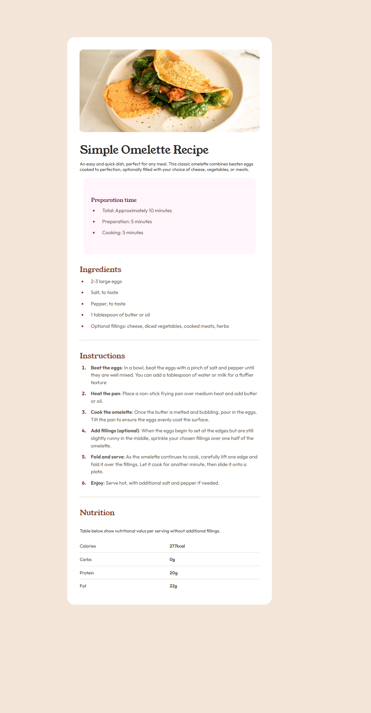

# Frontend Mentor - Recipe Page Solution

This is a solution to the [Recipe page challenge on Frontend Mentor](https://www.frontendmentor.io/challenges/recipe-page-Kiib_0B79).

Frontend Mentor challenges help you improve your coding skills by building realistic projects.

---

## 📸 Screenshot

  
  
<i>A preview of the result featuring.</i>

---

## 🔗 Links

- **Live Site URL:** [https://suhaibadill.github.io/recipe-page/](https://suhaibadill.github.io/recipe-page/)

---

## 🛠 My Process

### Built With

- **Semantic HTML5** markup for better accessibility.
- **CSS Custom Properties** (Variables) for consistent color management.
- **CSS Grid** for the nutrition table layout.
- **Flexbox** for centering the main card and alignment.
- **Responsive Design** using Media Queries for mobile-first optimization.

---

## 🚀 What I Learned

- **Advanced List Styling:** Learned how to style list markers (`::marker`) to match the design's specific colors and font weights.
- **Grid Layout for Data:** Used `display: grid` to create a clean, aligned nutrition table with borders.
- **Typography Management:** Integrated multiple Google Fonts and managed different line-heights and letter-spacings for better readability.
- **Semantic Structure:** Effectively used `<main>`, `<section>`, and `
` tags to create a logical document flow.

---

## 👤 Author

- Frontend Mentor - [@suhaibadill](https://www.frontendmentor.io/profile/suhaibadill)
